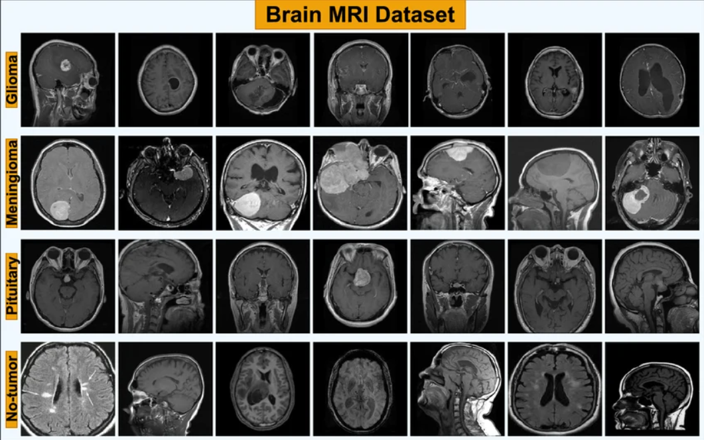
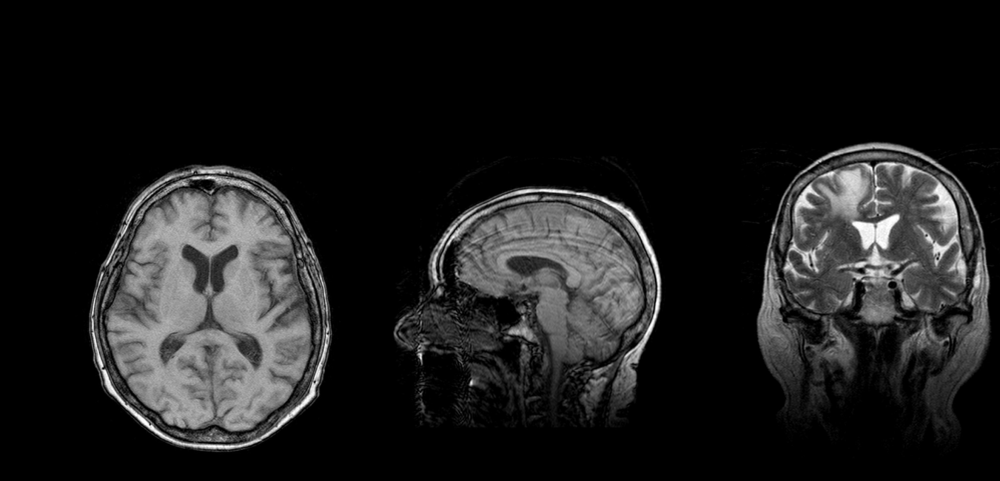
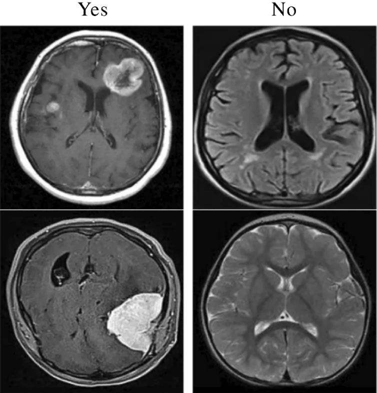
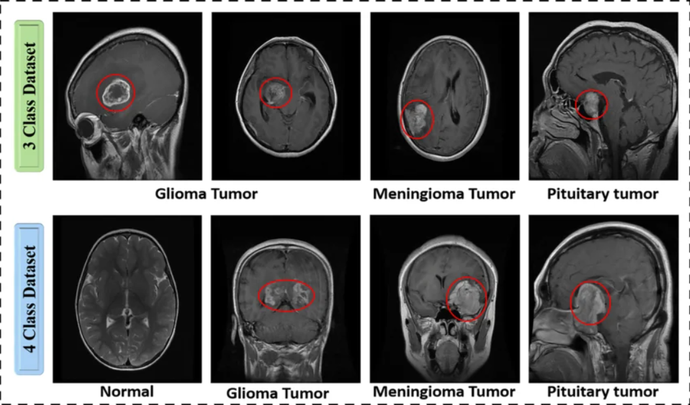

# Brain Tumor Image Classification

A deep learning-based system for automated classification of brain tumors from MRI scans using Convolutional Neural Networks (CNNs). The model is trained to distinguish between multiple tumor types and healthy brain tissue, supporting early and accurate diagnosis.


---


##  Project Images






---

## Table of Contents

- [Overview](#overview)
- [Dataset](#dataset)
- [Model Architecture](#model-architecture)
- [Installation](#installation)
- [Results](#results)
- [Project Structure](#project-structure)
- [Technologies Used](#technologies-used)


---

## Overview

Brain tumors are among the most critical medical conditions requiring timely and accurate diagnosis. Manual interpretation of MRI scans is time-intensive and subject to human variability. This project applies deep learning to automate the classification of brain MRI images into the following categories:

- Glioma Tumor
- Meningioma Tumor
- Pituitary Tumor
- No Tumor

The goal is to assist radiologists and clinicians by providing a reliable, fast, and reproducible second-opinion tool.

---

## Dataset

The model is trained on a publicly available brain tumor MRI dataset. The dataset is organized into training and testing splits across four classes.

| Class             | Description                                                                 |
|-------------------|-----------------------------------------------------------------------------|
| Glioma            | Tumors occurring in the brain or spinal cord                                |
| Meningioma        | Tumors arising from the meninges surrounding the brain and spinal cord      |
| Pituitary         | Tumors forming in the pituitary gland inside the skull                      |
| No Tumor          | Healthy brain MRI with no detectable tumor                                  |

**Source:** [Kaggle - Brain Tumor MRI Dataset](https://www.kaggle.com/datasets/masoudnickparvar/brain-tumor-mri-dataset)

---

## Model Architecture

The classification pipeline includes the following stages:

1. **Preprocessing** - Image resizing, normalization, and data augmentation (rotation, flipping, zoom)
2. **Feature Extraction** - Convolutional layers to learn spatial features from MRI scans
3. **Classification** - Fully connected dense layers with softmax output for multi-class prediction

Transfer learning from a pre-trained backbone (such as VGG16 or ResNet50) may be applied to improve performance on limited medical imaging data.

---

## Installation

### Prerequisites

- Python 3.8 or higher
- pip

### Steps

```bash
# Clone the repository
git clone https://github.com/satviklandge/Brain-Tumor-Image-Classification.git
cd Brain-Tumor-Image-Classification

# Create a virtual environment (recommended)
python -m venv venv
source venv/bin/activate        # On Windows: venv\Scripts\activate

# Install dependencies
pip install -r requirements.txt
```

---


## Results

| Metric       | Value  |
|--------------|--------|
| Training Accuracy | ~XX% |
| Validation Accuracy | ~XX% |
| Test Accuracy | ~XX% |
| Loss         | ~X.XX  |

> Update the table above with actual results after training.

Confusion matrix and per-class performance metrics are generated and saved to the `outputs/` directory after evaluation.

---

## Project Structure

```
Brain-Tumor-Image-Classification/
│
├── data/
│   ├── Training/
│   │   ├── glioma_tumor/
│   │   ├── meningioma_tumor/
│   │   ├── pituitary_tumor/
│   │   └── no_tumor/
│   └── Testing/
│
├── models/                    # Saved model weights
├── notebooks/                 # Jupyter notebooks for EDA and experimentation
├── outputs/                   # Confusion matrix, plots, evaluation results
│
├── train.py                   # Model training script
├── predict.py                 # Inference script
├── app.py                     # Web application (Flask/Streamlit)
├── requirements.txt
└── README.md
```

---

## Technologies Used

- **Python** - Core programming language
- **TensorFlow / Keras** - Deep learning framework
- **NumPy / Pandas** - Data manipulation
- **OpenCV / PIL** - Image preprocessing
- **Matplotlib / Seaborn** - Visualization
- **Flask / Streamlit** - Web deployment interface (if applicable)
- **Scikit-learn** - Evaluation metrics

---


## Disclaimer

This project is intended for research and educational purposes only. It is not a certified medical diagnostic tool and should not be used as a substitute for professional medical advice or clinical diagnosis.
